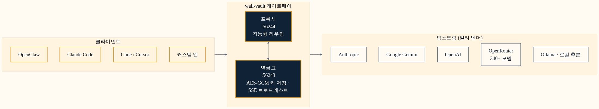
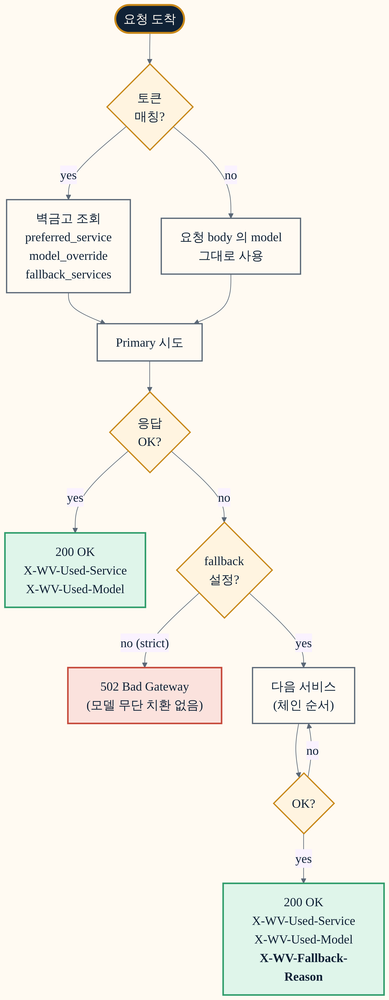
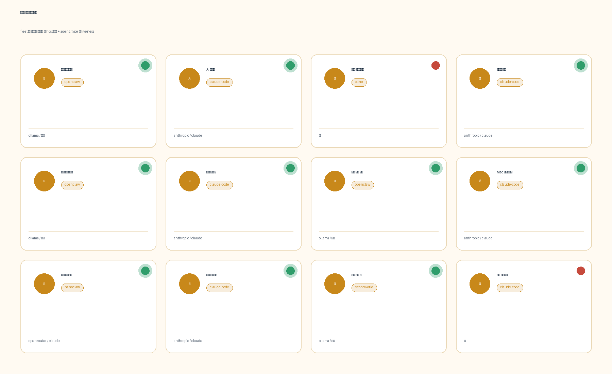
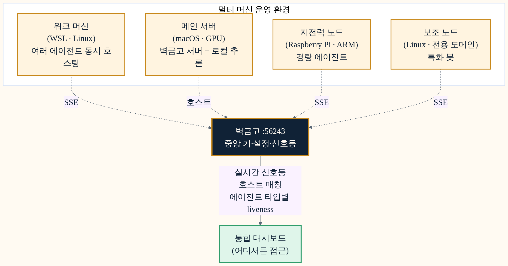
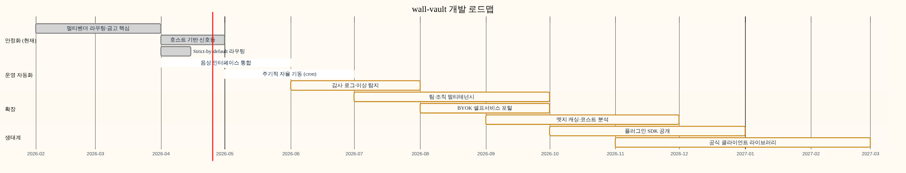

<!-- _class: lead -->
<!-- _paginate: false -->
<!-- _footer: "" -->

# wall-vault

## AI 가 절대 끊기지 않는 멀티벤더 게이트웨이

키 금고 · 지능형 라우팅 · fleet observability — 한 바이너리에

---

<!-- _class: section-break -->
<!-- _paginate: false -->

## 문제 의식

# AI 가 멈추는 순간, 일도 멈춥니다

---

## **AI 가 끊기는 순간**, 비용은 두 배가 됩니다

- 클라우드 **API 키 만료·쿨다운·credit-out**
- 벤더별로 다른 **모델 ID 네임스페이스** (Anthropic / OpenAI / Google / OpenRouter)
- **여러 머신·여러 에이전트** 가 같은 자원을 공유하는데 신호 가시성 0
- **Fallback 이 조용히 다른 모델로 바꿔치기** 해서 응답 품질이 무너짐
- 운영자가 *"왜 또 멈췄지?"* 를 매일 묻게 됨

> "키 하나 죽으면 fleet 전체가 멈춥니다. 그게 어디서 어떻게 멈췄는지조차 보이지 않습니다."

---

## **wall-vault** — 한 줄 정의

# **AES-GCM 암호화 키 금고** + **지능형 멀티벤더 프록시**

암호화 저장
자동 키 로테이션
정직한 라우팅
실시간 신호등

한 개의 Go 바이너리, 무설치 의존성, 17 개 언어, Linux / macOS / Windows / WSL.

---

## 아키텍처 — 한 장으로 보는 동작

> **벽금고**(:56243) 가 키·설정의 단일 소스, **프록시**(:56244) 가 클라이언트와 업스트림 사이의 지능형 라우터. SSE 로 실시간 동기화.

---

<!-- _class: section-break -->
<!-- _paginate: false -->

## 차별점

# 시중 솔루션과 다른 세 가지

---

## 차별점 ① **멀티벤더를 진짜로 통합**

- **4 가지 API 포맷** 동시 노출  
  Gemini · OpenAI · Anthropic · OpenRouter
- **170+ 모델** 자동 라우팅  
  로컬 Ollama 부터 Claude / Gemini / GPT 까지
- 클라이언트는 **자기가 가장 익숙한 형식** 그대로 호출  
  Cline·Cursor·Claude Code·OpenClaw — 코드 변경 없이 통합

4API 포맷

170+모델

10+에이전트 타입

---

## 차별점 ② **정직한 라우팅** (Strict-by-default)

- **Primary 실패 시 무단 모델 치환 없음**  
  fallback 은 **명시적 opt-in** 만
- 응답 헤더로 **실제 사용 서비스·모델·fallback 사유** 노출  
  `X-WV-Used-Service` / `X-WV-Used-Model` / `X-WV-Fallback-Reason`
- 호출자가 *"내가 원한 모델로 답이 왔는가"* 를 **헤더 한 줄로 검증**

---

## 차별점 ③ **Fleet observability** — 한 곳에서 다 봅니다

---

<!-- _class: section-break -->
<!-- _paginate: false -->

## 운영 검증

# 매일 돌아갑니다

---

## 실측 운영 — **여러 머신, 다양한 OS, 끊김 없음**

- WSL/Linux · macOS/GPU · ARM SBC · 전용 도메인 노드 — **OS·아키텍처 무관**하게 동일 바이너리 배포
- 호스트 매칭 + 에이전트 타입별 liveness probe 로 **거짓 초록불·거짓 빨간불 모두 제거**
- AES-GCM 키 로테이션 + 자동 쿨다운으로 **클라우드 credit-out 일에도 즉시 로컬 추론으로 전환**
- 단일 머신 운영부터 **수십 노드 분산 운영**까지 **같은 도구**

---

## **17 개 언어** — 글로벌 준비 완료

대시보드·CLI·시스템 메시지 전체 다국어. **언어 전환은 클릭 한 번**.

🇰🇷 🇺🇸 🇯🇵 🇨🇳 🇩🇪 🇫🇷 🇪🇸 🇵🇹 🇮🇩 🇹🇭 🇮🇳 🇳🇵 🇲🇳 🇸🇦 🇪🇹 🇰🇪 🇿🇦

한국어English日本語中文DeutschFrançaisEspañolPortuguêsBahasa Indonesiaไทยहिन्दीनेपालीМонголالعربيةHausaKiswahiliisiZulu

한국 본사 + 동남아·중동·아프리카·라틴 시장 동시 대응 — <strong>로컬라이즈된 AI 게이트웨이</strong>.

---

## 경쟁 비교 — **암호화·페르소나·실시간성** 모두

<table class="compare">
<thead>
<tr>
  <th>기능</th>
  <th>wall-vault</th>
  <th>LiteLLM</th>
  <th>OpenRouter SDK</th>
  <th>벤더 SDK 직접</th>
</tr>
</thead>
<tbody>
<tr><td>AES-GCM 암호화 키 금고</td>          <td class="yes">✓</td><td class="no">✗</td><td class="no">✗</td><td class="no">✗</td></tr>
<tr><td>4 API 포맷 동시 노출</td>            <td class="yes">✓</td><td class="yes">✓</td><td class="no">✗</td><td class="no">✗</td></tr>
<tr><td>Strict-by-default + fallback 헤더</td><td class="yes">✓</td><td class="no">✗</td><td class="no">✗</td><td class="no">✗</td></tr>
<tr><td>SSE 실시간 fleet 동기화</td>         <td class="yes">✓</td><td class="no">✗</td><td class="no">✗</td><td class="no">✗</td></tr>
<tr><td>에이전트 페르소나 · 음성 통합</td>   <td class="yes">✓</td><td class="no">✗</td><td class="no">✗</td><td class="no">✗</td></tr>
<tr><td>17 개국 다국어 UI</td>               <td class="yes">✓</td><td class="no">✗</td><td class="no">✗</td><td class="no">✗</td></tr>
<tr><td>한 바이너리·무의존</td>              <td class="yes">✓</td><td class="no">Python</td><td class="no">JS</td><td class="no">언어별</td></tr>
</tbody>
</table>

---

## 로드맵 — **음성 → 자율 기동 → 멀티테넌시**

---

<!-- _class: lead -->
<!-- _paginate: false -->
<!-- _footer: "" -->

# 함께 만들어 갈까요?

데모 요청
파일럿 도입
기술 제휴
투자 검토

연구실 운영자에서 출발했습니다. 이제 시장 차례입니다.

